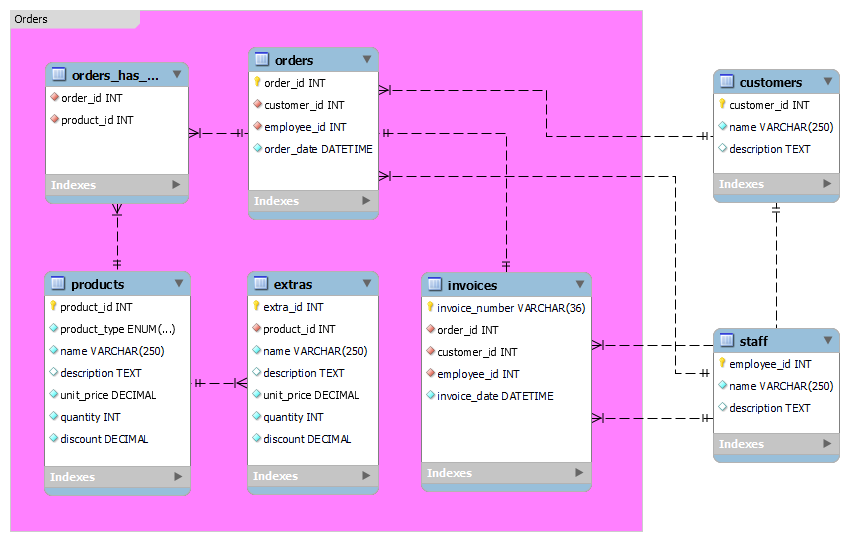

# Charlene's Coffee Corner

Recently, Charlene decided to open her very own little coffee shop on a busy street corner.

Being the careful entrepreneur, she decided to start off with a limited offering, with the option to expand her choice of products as business goes.

## Her Offering
- Coffee (small, medium, large) 2.50 CHF, 3.00 CHF, 3.50 CHF 
- Bacon Roll 4.50 CHF
- Freshly squeezed orange juice (0.25l) 3.95 CHF

## Extras
- Extra milk 0.30 CHF
- Foamed milk 0.50 CHF
- Special roast coffee 0.90 CHF

## Bonus Program
Charlene's idea is to attract as many regular's as possible as to have a steady turnaround. She decides to offer a customer stamp card, where every 5th beverage is for free.

If a customer orders a beverage and a snack, one of the extra's is free.

## Your Task Is To
Write a simple program whose output is formatted like a receipt that you would usually receive at a supermarket.

The input to the program is a list of products the customer wants to purchase (large coffee with extra milk, small coffee with special roast, bacon roll, orange juice)

## Important
- The only libraries which can be used are Java SE (any version) and JUnit (any version)
- Test Driven Development (TDD) is the recommended approach. In any case the solution must have automated tests
- There is no Graphical User Interface required and no persistence. It's a simple program
- If you come across an ambiguous requirement, make a sensible assumption and proceed

Please deliver all required artifacts, so that the program and its tests can be executed standalone, and make them available via Github or BitBucket (our email server otherwise blocks them).